<div align="center">

# Java Lab Collection

### A structured Java learning repository focused on Object-Oriented Programming and software design fundamentals.

<br>

[](https://www.oracle.com/java/)
[](#-core-concepts)
[](#-laboratory-work)
[](https://git-scm.com/)
[](https://github.com/)

<br>

**Classes · Encapsulation · Object Relationships · Inheritance · Interfaces**

</div>

---

## Table of Contents

* [Overview](#-overview)
* [Objectives](#-objectives)
* [Laboratory Work](#-laboratory-work)
* [Core Concepts](#-core-concepts)
* [Learning Progression](#-learning-progression)
* [Technology Stack](#-technology-stack)
* [Repository Structure](#-repository-structure)
* [Getting Started](#-getting-started)
* [Development Workflow](#-development-workflow)
* [Engineering Practices](#-engineering-practices)
* [Learning Outcomes](#-learning-outcomes)
* [What I Learned](#-what-i-learned)
* [Future Improvements](#-future-improvements)
* [Related Projects](#-related-projects)
* [Author](#-author)

---

# Overview

This repository contains a structured collection of **Java laboratory exercises** completed during my Software Engineering studies.

The primary focus is developing a strong foundation in **Object-Oriented Programming (OOP)** through practical implementation.

Rather than treating each laboratory as an isolated assignment, this repository documents a progression from basic Java programming toward object-oriented design:

```text
Java Fundamentals
        │
        ▼
Classes & Objects
        │
        ▼
Methods & Encapsulation
        │
        ▼
Object Relationships
        │
        ▼
Inheritance
        │
        ▼
Interfaces
        │
        ▼
Object-Oriented Design
```

The concepts developed in these exercises provide the foundation for larger Java applications, database systems, backend services, and enterprise software.

---

# Objectives

The repository was developed with the following objectives:

* Build strong Java programming fundamentals
* Understand object-oriented programming principles
* Learn how to model real-world entities as objects
* Practice designing classes and their relationships
* Understand encapsulation and data hiding
* Implement inheritance and polymorphism concepts
* Understand association, aggregation, and composition
* Implement interfaces
* Improve programming and debugging skills
* Develop structured and maintainable code

---

# Laboratory Work

|   Lab  | Focus Area           | Concepts                                       |
| :----: | -------------------- | ---------------------------------------------- |
| **01** | Java Fundamentals    | Basic Java programming                         |
| **02** | Java Fundamentals    | Programming practice                           |
| **03** | Objects & Methods    | Classes, objects, instance methods             |
| **04** | Encapsulation        | Access modifiers, getters, setters             |
| **05** | Inheritance          | Multi-level / hierarchical class relationships |
| **06** | Interfaces           | Contracts and implementation                   |
| **07** | OOP Practice         | Object-oriented problem solving                |
| **08** | Object Relationships | Association, aggregation, composition          |
| **09** | Inheritance          | `is-a` relationship and code reuse             |
| **10** | Java Practice        | Consolidation of Java concepts                 |

### Academic Documentation

The original laboratory documents are retained in the repository as supporting academic material.

Where possible, source-code implementations should be maintained alongside the original laboratory documentation.

---

# Core Concepts

## Classes & Objects

Classes define the structure and behavior of objects.

```java
public class Student {

    private String name;

    public Student(String name) {
        this.name = name;
    }

    public void display() {
        System.out.println("Student: " + name);
    }
}
```

This establishes the foundation for modeling real-world entities in software.

---

## Encapsulation

Encapsulation protects an object's internal state and exposes controlled access through methods.

```java
public class Student {

    private String name;

    public String getName() {
        return name;
    }

    public void setName(String name) {
        this.name = name;
    }
}
```

Key concepts:

* Access modifiers
* Data hiding
* Getters and setters
* Controlled state modification

---

## Association

Association represents a relationship between independent objects.

```text
Teacher ───────── Student
```

Both objects can exist independently.

---

## Aggregation

Aggregation represents a weak **has-a** relationship.

```text
Department ◇──── Professor
```

The contained object can exist independently from the container.

---

## Composition

Composition represents a strong **has-a** relationship.

```text
House ◆──── Room
```

The lifecycle of the contained object is strongly associated with its owner.

---

## Inheritance

Inheritance enables a child class to reuse and extend functionality from a parent class.

```text
             Person
                │
        ┌───────┴───────┐
        ▼               ▼
     Student          Teacher
```

This demonstrates:

* `is-a` relationships
* Code reuse
* Parent-child class hierarchies
* Method overriding

---

## Interfaces

Interfaces define contracts that implementing classes must fulfill.

```java
public interface Payable {

    void calculatePayment();
}
```

Implementation:

```java
public class Employee implements Payable {

    @Override
    public void calculatePayment() {
        System.out.println("Calculating payment...");
    }
}
```

Interfaces encourage abstraction and flexible software design.

---

# Learning Progression

```mermaid
flowchart LR

    A["Java Fundamentals"]
    B["Classes & Objects"]
    C["Instance Methods"]
    D["Encapsulation"]
    E["Association"]
    F["Aggregation"]
    G["Composition"]
    H["Inheritance"]
    I["Interfaces"]
    J["OOP Design"]

    A --> B
    B --> C
    C --> D
    D --> E
    E --> F
    F --> G
    G --> H
    H --> I
    I --> J
```



The sequence reflects the transition from basic programming constructs toward object-oriented software design.

---

# Technology Stack

| Category                | Technology                      |
| ----------------------- | ------------------------------- |
| Programming Language    | **Java 17+**                    |
| Programming Paradigm    | **Object-Oriented Programming** |
| Version Control         | **Git**                         |
| Repository Hosting      | **GitHub**                      |
| Development Environment | **Sublime Text / Java IDE**     |

### Why Java?

Java provides a strong foundation for learning:

* Object-oriented design
* Type safety
* Exception handling
* Collections
* Interfaces
* Generics
* Enterprise application development

The concepts learned here can later be applied to technologies such as **JDBC, Spring Boot, REST APIs, testing frameworks, and enterprise applications**.

---

# Repository Structure

### Current Academic Structure

```text
java-labs/
│
├── Lab01/
│   └── Java Lab2.docx
│
├── Lab02/
│   └── Majid Ali java (lab1).docx
│
├── Lab03/
│   └── Majid Ali java lab3.docx
│
├── Lab04/
│   └── Majid Ali java lab4.docx
│
├── Lab05/
│   └── Majid ali java (lab10).docx
│
├── Lab06/
│   └── Majid ali java (lab12).docx
│
├── Lab07/
│   └── Majid ali java (lab7).docx
│
├── Lab08/
│   └── Majid ali java (lab8).docx
│
├── Lab09/
│   └── Majid ali java (lab9).docx
│
├── Lab10/
│   └── Majid ali java lab6.docx
│
└── README.md
```

### Recommended Engineering Structure

As the repository evolves, source code can be organized as:

```text
java-labs/
│
├── lab-01/
│   ├── src/
│   └── README.md
│
├── lab-02/
│   ├── src/
│   └── README.md
│
├── lab-03/
│   ├── src/
│   └── README.md
│
├── ...
│
├── .gitignore
├── README.md
└── LICENSE
```

This makes the repository easier to navigate and allows each laboratory to become independently understandable.

---

# Getting Started

## Prerequisites

Install:

* Java Development Kit **17 or later**
* Git
* A Java-compatible IDE or editor

Verify Java:

```bash
java -version
```

Verify the compiler:

```bash
javac -version
```

---

## Clone the Repository

```bash
git clone https://github.com/Majid-Ali01/java-labs.git
```

Navigate into the repository:

```bash
cd java-labs
```

---

# Running a Laboratory

If a laboratory contains a Java source file such as:

```text
Main.java
```

Compile it:

```bash
javac Main.java
```

Run it:

```bash
java Main
```

For projects containing multiple Java files:

```bash
javac *.java
```

Then:

```bash
java Main
```

The exact entry-point class may differ between laboratories.

---

# Development Workflow

The laboratory exercises follow a practical development cycle:

```text
        Requirement
            │
            ▼
      Understand Problem
            │
            ▼
       Design Classes
            │
            ▼
       Implement Code
            │
            ▼
        Compile
            │
            ▼
          Test
            │
            ▼
         Debug
            │
            ▼
         Refactor
            │
            ▼
          Commit
```

This workflow encourages the transition from simply writing code to thinking about software structure and maintainability.

---

# Engineering Practices

The repository is gradually moving toward professional software-development practices.

### Current Practices

* Object-oriented class design
* Encapsulation
* Reusable methods
* Clear class responsibilities
* Version control with Git
* Structured repository organization
* Technical documentation

### Planned Practices

* Unit testing
* JavaDoc
* Maven/Gradle dependency management
* Automated builds
* Continuous Integration
* Static analysis
* Code formatting
* Design patterns
* UML documentation

---

# Learning Outcomes

By completing these exercises, I developed practical understanding of:

### Java

* Variables and data types
* Classes
* Objects
* Methods
* Constructors
* Access modifiers
* Basic program structure

### Object-Oriented Programming

* Encapsulation
* Inheritance
* Polymorphism
* Abstraction
* Interfaces
* Association
* Aggregation
* Composition

### Software Design

* Identifying objects
* Assigning responsibilities to classes
* Modeling relationships
* Reusing existing functionality
* Designing maintainable code

### Development Skills

* Compiling Java applications
* Debugging errors
* Testing program behavior
* Using Git
* Managing a GitHub repository
* Documenting technical work

---

# What I Learned

The most important outcome of these laboratories was learning to think about software in terms of **objects and responsibilities** rather than only individual lines of code.

I learned how to:

* Convert real-world entities into classes
* Represent state and behavior within objects
* Protect object state through encapsulation
* Model relationships between objects
* Reuse functionality through inheritance
* Define contracts through interfaces
* Break larger problems into smaller components
* Debug and improve Java programs

These concepts now provide the foundation for more advanced Java development.

---

# From Labs to Applications

The concepts demonstrated in this repository are directly applicable to larger software projects.

```text
Java Fundamentals
        ↓
OOP
        ↓
Collections & Generics
        ↓
Exception Handling
        ↓
File I/O
        ↓
JDBC
        ↓
MySQL
        ↓
Design Patterns
        ↓
Unit Testing
        ↓
Spring Boot
        ↓
REST APIs
        ↓
Production Applications
```

This repository therefore represents the **foundation layer** of my Java development journey.

---

# Future Improvements

* [ ] Convert all laboratory documents into organized source-code projects
* [ ] Add individual README files for each laboratory
* [ ] Add sample input/output
* [ ] Add UML class diagrams
* [ ] Add JavaDoc
* [ ] Add JUnit tests
* [ ] Introduce Maven or Gradle
* [ ] Add automated builds
* [ ] Add GitHub Actions CI
* [ ] Apply appropriate design patterns
* [ ] Improve code quality and consistency
* [ ] Build larger applications using these OOP concepts

---

# Related Projects

The concepts developed in this repository are applied in larger Java projects, including:

### Quiz Management System

A Java Swing + MySQL desktop application demonstrating:

* OOP
* JDBC
* MySQL
* GUI development
* Authentication
* Quiz management
* Database persistence

Repository:

`github.com/Majid-Ali01/quiz-management-system`

---

# Academic Context

| Attribute         | Details                          |
| ----------------- | -------------------------------- |
| Project Type      | University Laboratory Collection |
| Field             | Software Engineering             |
| Language          | Java                             |
| Level             | Undergraduate                    |
| Primary Focus     | Object-Oriented Programming      |
| Repository Status | Active Learning Repository       |

---

# Author

<div align="center">

## Majid Ali

**Software Engineering Student**

Java • Object-Oriented Programming • Software Engineering

<br>

<a href="https://github.com/Majid-Ali01">

</a>

<a href="https://www.linkedin.com/in/majid-ali-3027b03ab/">

</a>

</div>

---

# License

This repository is primarily intended for **educational and portfolio purposes**.

If a formal open-source license is added, the license information should be updated here accordingly.

---

<div align="center">

### Java → OOP → Design → Engineering

**Learning the fundamentals. Building practical software. Improving continuously.**

</div>
